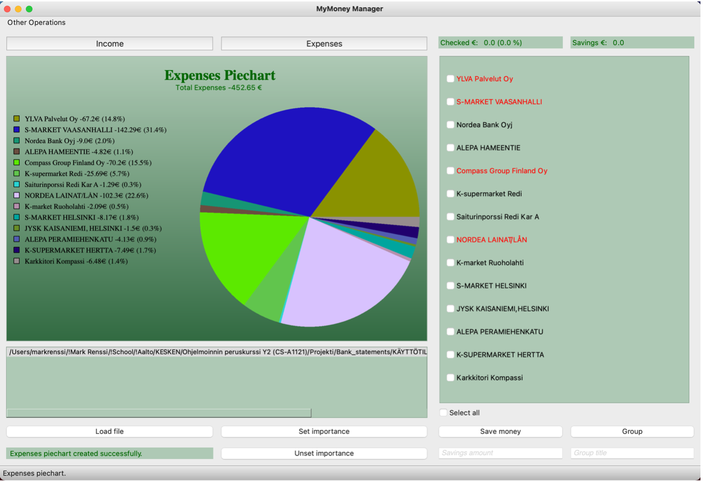
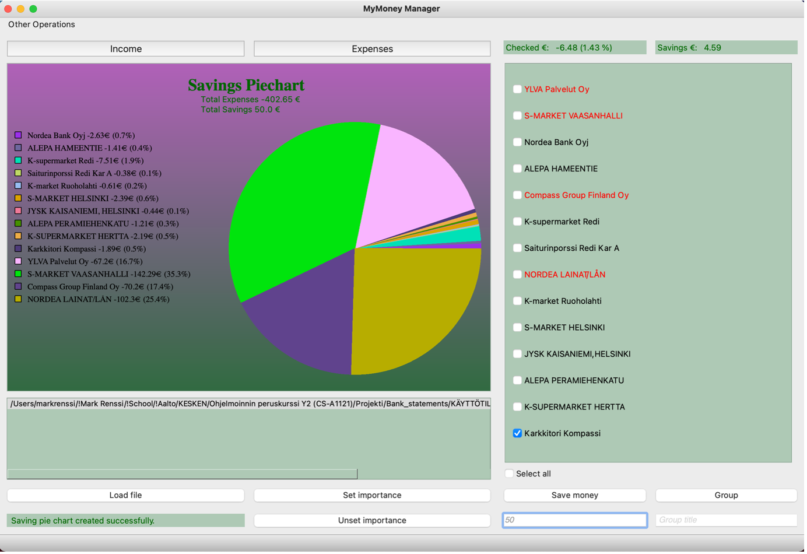

# Money Management Application

I have created a money management program that as a basis function reads transactions from a CSV-formatted bank statement, separates expenses and income and draws a separate pie chart for both expenses and income. New transaction records can be added to the existing data without any restrictions. The program supports at least CSV-formatted bank statements of Nordea and OP. Below, program’s view of expenses pie chart is displayed which is based on a single bank statement.

The program automatically recognizes expense transactions belonging to a specific store, adds their sums together and displays them in one line. This one expenses line can be considered as a group comprising all expense transactions belonging to the same specific store. As a note to avoid confusion, thorough this report the words “expenditure group” and “expenses line” will be used interchangeably and refer to the exactly same thing. The user can modify these expenditure groups by renaming them, joining them together with other expenditure groups or deleting them. The user has complete freedom to join these different groups together whether manually one at a time or all at the same time by checking corresponding checkboxes. For instance, the user can group all expenses relating to groceries by checking checkboxes of all different grocery stores. 
The program also automatically recognizes income transactions belonging to the same source, however, all modifying functionalities have been omitted for these. The reason behind this decision is the fact that the target group of this program is individuals, which compared to businesses, do not have many income sources and hence don’t have many income transactions in the bank statements. This is mainly expenses focused program. 
As another basis function, the program displays the user a pie chart on how the expenses should be allocated in order to achieve the savings amount that has been input by the user. The program automatically calculates how the expenses should be cut in order to reach the given savings amount using implemented savings algorithm. The user can affect this savings algorithm by setting certain expenditure groups as important and unimportant. When a group is set as important, the algorithm will exclude this group from savings calculations and the sum of the group will remain the same. The program decides also by default which groups are important and which groups are not. This decision is made based on the occurrences and total sums of transactions in a expenditure group. The user can always unset the importance if needed. Important expenditure groups are marked in red in the program. For instance, below, a savings pie chart is displayed based on input of 50€. By checking the “Karkkitori Kompassi”, the user can view on the upper right corner the original sum of the checked expenditure group (6.48), expenditure group’s percentual share of the total sum of expenses (1.43 %) and how much needs to be saved on this specific expenditure group (4.59) in order to achieve the savings amount of 50€

## Instructions for the user

The program is launched from the main.py file by pressing the play button next to the condition if __name__ == ‘__main__’. Below, instructions on how to use the program are presented:
*	The opening screen of the program shows instructions on how to use the program.
*	Drag and drop csv-formatted bank statements to the field above “Load file” and “Set importance” buttons. Multiple bank statements can be dropped simultaneously. 
*	In order to graph a pie chart, the user should highlight the dropped file and press “Load file” button. The pie chart will be graphed. Multiple bank statements can be loaded and the same bank statement can be loaded unlimited amount of times.
*	Once the pie chart has been graphed, the user can switch between income pie chart and expenses pie chart by pressing “income” and “Expenses” buttons that are located above the graphed pie chart.
*	The user can hover over pie slices to see which slice corresponds to which label. 
*	The user can group expenditure groups/expense lines together by checking checkboxes of the expenses to be grouped, by adding a group title to the text field below the “Group” button and by pressing the “Group” button. The program will then graph a pie chart based on the new expenses lines. If accidentally the user forgets to add a group title or to check any checkbox before pressing the “Group” button, the program will print a warning message. All warning messages are shown in the label field situated below the “Load file” button. The program will also highlights the “Group title” input field in red if the field is remained empty.
*	In case the title of some expense line needs to be renamed, the user should only check the checkbox of this particular expense, add a new expense line title to the text field below the “Group” button and press the “Group” button. The program will then graph a pie chart with this expenses line’s title renamed.
*	The user can set importance or unset importance of expenses lines by checking necessary checkboxes and by pressing “Set importance” to mark checked expenses lines as important and by pressing “Unset importance” to mark checked expenses lines as unimportant. Important expenses lines are written in red. 
*	For the user convenience, “Select all” checkbox has been provided above the “Save money” button with which the user can check and uncheck all the checkboxes simultaneously.
*	The user can graph a savings pie chart by typing a savings amount to the input field below the “Save money” button and by pressing “Save money” button. The savings pie chart will be graphed provided that the input savings amount is of correct type and the input savings amount is above the sum of unimportant expenses. Please note that money can’t be saved from important expenses! In case the pie chart can’t be graphed, the program will output a warning message to the label field situated below the “Load file” button. 
*	User can select additional functionalities from the menu bar “Other Operations”: 
   -	By selecting “Clear window”, the whole window will be cleared.
   -	By selecting “Show info”, the info window will be displayed. 
   -	By selecting “Quit”, the program will be exited. 
   -	By checking checkboxes of expenses lines and by selecting “Delete row”, a new pie chart without the checked expenses lines will be graphed. 
   -	These functionalities also work with keyboard shortcuts. 
*	The label field “Checked €:” situated next to the “Expenses” button indicates the aggregate sum of the checked checkboxes and their percentual share of the total sum of expenses. The label field “Savings €:” indicates the checked checkboxes’ share of the savings amount. Checking only important expenses lines will display 0 in this field since money can’t be saved from important expenses.
